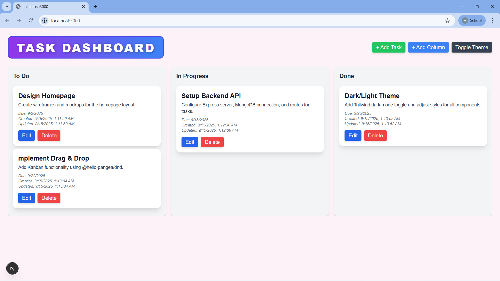
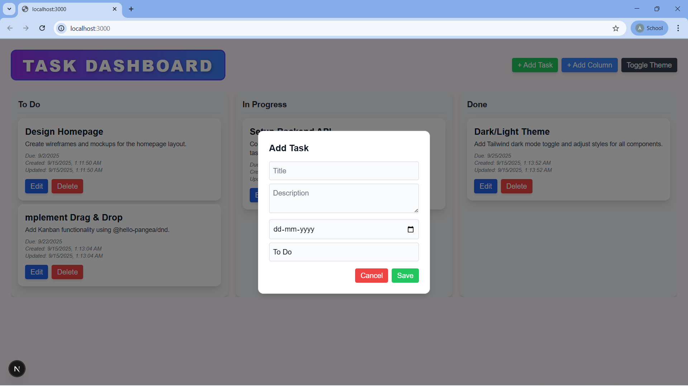
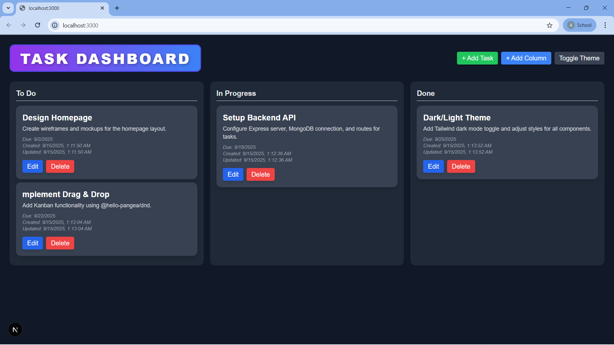

# Task Dashboard

A full-stack Task Management Dashboard built with **Next.js (frontend)** and **Express.js (backend)**. Manage tasks with CRUD operations, drag-and-drop Kanban board, and dark/light theme toggle.

---

### Run Locally

#### Backend (Express API)
```bash
cd backend
npm install
npm run dev
```
Runs on http://localhost:5000

#### Frontend (Next.js App)
```bash
cd frontend
npm install
npm run dev
```
Runs on http://localhost:3000

---

### Code Structure

```
/frontend   -> Next.js app (UI, pages, components)
/backend    -> Express.js API (routes, controllers)
```

- **Frontend**
  - `pages/` → Next.js pages (dashboard, tasks, etc.)
  - `components/` → Reusable UI components
- **Backend**
  - `routes/` → API endpoints (`/tasks`)
  - `controllers/` → Business logic (task CRUD)

---

### Features

- ✅ Task CRUD: Create, read, update, delete tasks  
- ✅ Kanban Board: Drag-and-drop tasks between statuses  
- ✅ Task Details: View title, description, due date, timestamps  
- ✅ Add/Edit Tasks: Modal popup with form validation  
- ✅ Responsive Design: Works on desktop and mobile  
- ✅ Dark/Light Theme Toggle  
- ✅ Professional UI: Styled with Tailwind CSS  

---

### Demo

**Dashboard Preview**  
  

**Add Task**  
  

**Dark Theme**  
  


### How to Use

1. Start the backend:  
```bash
cd backend && npm start
```
Runs on http://localhost:5000

2. Start the frontend:  
```bash
cd frontend && npm run dev
```
Runs on http://localhost:3000

3. Open http://localhost:3000 in your browser.  
4. Create, edit, or delete tasks and manage your dashboard.

---

### Libraries Used & Purpose

- Next.js: React framework for UI and routing  
- React: Frontend component library  
- Axios: For API requests to backend  
- Express.js: Backend API framework  
- Mongoose: MongoDB integration  
- Cors: Allow frontend-backend communication  
- Dotenv: Manage environment variables  
- Tailwind CSS: UI styling  
- React DnD / @hello-pangea/dnd: Drag-and-drop Kanban functionality  

---

### Features

- ✅ Task CRUD: Create, read, update, delete tasks  
- ✅ Kanban Board: Drag-and-drop tasks between statuses  
- ✅ Task Details: View title, description, due date, timestamps  
- ✅ Add/Edit Tasks: Modal popup with form validation  
- ✅ Responsive Design: Works on desktop and mobile  
- ✅ Dark/Light Theme Toggle  
- ✅ Professional UI: Styled with Tailwind CSS  

### ➕ Extras Implemented

- Kanban Board with drag-and-drop (React DnD)  
- Dark/Light theme toggle  
- Custom status column support (user can create new statuses)  
- Client-side form validation  
- Fully responsive design


### Author

**Abhishek Jain**

---

### Submission Ready

Repo link: [https://github.com/abhijain17/task-dashboard-2](https://github.com/abhijain17/task-dashboard-2)  

Screenshots and README are included, frontend and backend folders are complete. ✅
